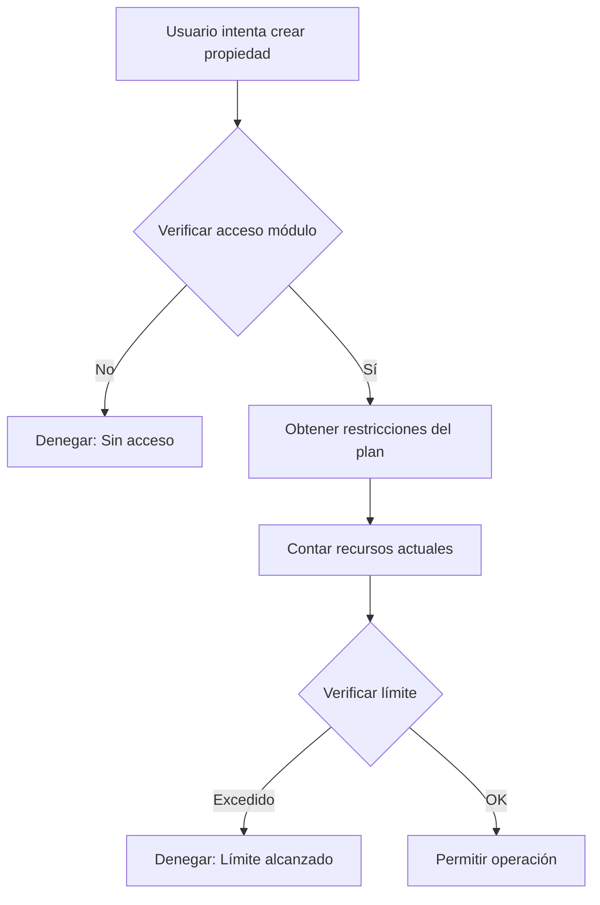

# Sistema de Límites y Permisos - PymeBot

## Tabla de Contenidos

1. [Introducción](#introducción)
2. [Sistema de Límites de Plan](#sistema-de-límites-de-plan)
3. [Sistema de Permisos](#sistema-de-permisos)
4. [Integración Frontend](#integración-frontend)
5. [Configuración en Base de Datos](#configuración-en-base-de-datos)
6. [Ejemplos de Uso](#ejemplos-de-uso)
7. [Troubleshooting](#troubleshooting)

## Introducción

PymeBot implementa un sistema robusto de límites y permisos para controlar el acceso a funcionalidades y recursos según el plan de suscripción y rol del usuario.

## Sistema de Límites de Plan

### Arquitectura

El sistema de límites consta de tres componentes principales:

```
┌─────────────────┐     ┌──────────────────┐     ┌─────────────────┐
│   Components    │────▶│  usePlanLimits   │────▶│  limitsService  │
│  (React/Next)   │     │     (Hook)       │     │   (Service)     │
└─────────────────┘     └──────────────────┘     └────────┬────────┘
                                                           │
                                                           ▼
                                                    ┌──────────────┐
                                                    │   Supabase   │
                                                    │   Database   │
                                                    └──────────────┘
```

### Componentes Principales

#### 1. Hook `usePlanLimits` (`/hooks/core/usePlanLimits.ts`)

Hook de React para verificar límites desde componentes:

```typescript
const {
  checkOperationAllowed,  // Verificar si una operación está permitida
  getResourceUsage,       // Obtener uso actual de un recurso
  getModuleLimits,       // Obtener todos los límites de un módulo
  isLoading,             // Estado de carga
  limitExceeded,         // Si se excedió el límite
  limitReason,           // Razón del límite
  currentUsage,          // Uso actual del recurso
  checkResource,         // Verificar recurso específico
  refresh               // Refrescar datos
} = usePlanLimits();
```

#### 2. Servicio `limitsService` (`/services/core/limitsService.ts`)

Servicio que maneja la lógica de verificación:

- Verifica acceso a módulos
- Obtiene restricciones del plan
- Cuenta recursos actuales
- Implementa caché de 5 minutos
- Maneja reset periódico de límites

#### 3. Base de Datos

Tablas principales:
- `tenants`: Información del tenant y plan asignado
- `subscription_plans`: Planes de suscripción disponibles
- `plan_modules`: Relación plan-módulo con límites
- `modules`: Módulos del sistema

### Tipos de Límites

#### Límites de Recursos

```typescript
interface ResourceLimits {
  max_records: number;           // Registros máximos (propiedades, leads, etc)
  max_storage_mb: number;        // Almacenamiento en MB
  max_users_module: number;      // Usuarios por módulo
  max_templates: number;         // Plantillas máximas
  max_reports: number;           // Reportes máximos
  max_custom_fields: number;     // Campos personalizados
  max_active_appointments: number; // Citas activas
}
```

#### Límites con Reset Periódico

```typescript
interface PeriodicLimits {
  max_tokens: number;            // Tokens totales
  tokens_reset_period: 'daily' | 'monthly' | 'yearly';
  tokens_last_reset: string;     // ISO date
  
  max_api_calls_daily: number;   // Llamadas API diarias
  max_ai_tokens: number;         // Tokens de IA
  ai_tokens_reset_period: 'daily' | 'monthly' | 'yearly';
}
```

#### Feature Flags

```typescript
interface FeatureFlags {
  export_enabled: boolean;       // Permitir exportación
  import_enabled: boolean;       // Permitir importación
  api_access: boolean;          // Acceso a API
  advanced_reports: boolean;    // Reportes avanzados
}
```

### Flujo de Verificación



### Mapeo de Recursos

El sistema mapea automáticamente módulos a tablas:

```typescript
const mappings = {
  'bienes_raices': {
    'properties': {
      'records': { table: 'properties' }
    }
  },
  'medicina': {
    'patients': {
      'records': { table: 'patients' }
    }
  }
};
```

## Sistema de Permisos

### Arquitectura de Permisos

```
┌─────────────────┐     ┌──────────────────┐     ┌─────────────────┐
│   Middleware    │────▶│  Auth Provider   │────▶│ Permission Gate │
│   (Next.js)     │     │                  │     │  Components     │
└─────────────────┘     └──────────────────┘     └─────────────────┘
```

### Niveles de Permisos

#### 1. Roles del Sistema

```typescript
enum SystemRoles {
  SUPER_ADMIN = 'super_admin',    // Acceso total al sistema
  TENANT_ADMIN = 'admin',         // Admin del tenant
  MANAGER = 'manager',            // Gerente con permisos extendidos
  AGENT = 'agent',                // Agente/Usuario normal
  VIEWER = 'viewer'               // Solo lectura
}
```

#### 2. Permisos por Módulo

Cada módulo puede tener permisos granulares:

```typescript
interface ModulePermissions {
  view: boolean;      // Ver módulo
  create: boolean;    // Crear registros
  edit: boolean;      // Editar registros
  delete: boolean;    // Eliminar registros
  export: boolean;    // Exportar datos
  import: boolean;    // Importar datos
  manage: boolean;    // Administrar configuración
}
```

#### 3. Permisos por Vertical

Las verticales (bienes_raices, medicina, etc) tienen permisos adicionales:

```typescript
interface VerticalPermissions {
  access: boolean;              // Acceso a la vertical
  modules: string[];           // Módulos permitidos
  customPermissions?: Record<string, any>;
}
```

### Componentes de Permisos

#### 1. PermissionGate (`/components/core/permissions/PermissionGate.tsx`)

Componente para proteger UI basado en permisos:

```tsx
<PermissionGate 
  module="properties" 
  action="create"
  fallback={<NoPermissionMessage />}
>
  <CreatePropertyButton />
</PermissionGate>
```

#### 2. ModuleGate (`/components/core/permissions/ModuleGate.tsx`)

Protege acceso completo a módulos:

```tsx
<ModuleGate 
  vertical="bienes_raices" 
  module="properties"
>
  <PropertyList />
</ModuleGate>
```

#### 3. RoleGate (`/components/core/permissions/RoleGate.tsx`)

Protege basado en roles:

```tsx
<RoleGate roles={['admin', 'manager']}>
  <AdminPanel />
</RoleGate>
```

#### 4. FeatureGate (`/components/core/permissions/FeatureGate.tsx`)

Protege features específicas:

```tsx
<FeatureGate feature="export_enabled">
  <ExportButton />
</FeatureGate>
```

### Hooks de Permisos

#### usePermissionsCheck (`/hooks/core/usePermissionsCheck.ts`)

```typescript
const {
  hasPermission,      // Verificar un permiso específico
  hasRole,           // Verificar rol
  hasModuleAccess,   // Verificar acceso a módulo
  checkPermission,   // Verificar permiso async
  permissions,       // Lista de permisos actuales
  isLoading         // Estado de carga
} = usePermissionsCheck();
```

### Middleware de Autenticación

El middleware (`/middleware.ts`) verifica:

1. Autenticación del usuario
2. Acceso a verticales
3. Acceso a módulos específicos
4. Redirección según permisos

```typescript
// Verificación en middleware
if (!hasVerticalAccess) {
  return NextResponse.redirect('/vertical-unavailable');
}

if (!hasModuleAccess) {
  return NextResponse.redirect('/module-unauthorized');
}
```

## Integración Frontend

### Ejemplo: Lista de Propiedades con Límites

```tsx
// PropertyListProvider.tsx
const PropertyListProvider = () => {
  const { getResourceUsage } = usePlanLimits();
  const [usage, setUsage] = useState<ResourceUsage | null>(null);

  useEffect(() => {
    const loadUsage = async () => {
      const data = await getResourceUsage(
        'bienes_raices',
        'properties', 
        'records'
      );
      setUsage(data);
    };
    loadUsage();
  }, []);

  return (
    <div>
      {usage && (
        <Alert>
          Límites del plan: {usage.currentCount}/{usage.maxAllowed} propiedades
          <ProgressBar value={usage.percentageUsed} />
        </Alert>
      )}
      
      <PermissionGate module="properties" action="create">
        <CreatePropertyButton 
          disabled={usage?.isExceeded}
        />
      </PermissionGate>
    </div>
  );
};
```

### Ejemplo: Verificación antes de Crear

```tsx
const CreatePropertyButton = () => {
  const { checkOperationAllowed } = usePlanLimits();
  
  const handleCreate = async () => {
    const { allowed, reason } = await checkOperationAllowed(
      tenantId,
      'bienes_raices',
      'properties',
      'create',
      'records'
    );
    
    if (!allowed) {
      toast.error(reason || 'No puede crear más propiedades');
      return;
    }
    
    // Proceder con la creación
    router.push('/properties/new');
  };
  
  return <Button onClick={handleCreate}>Nueva Propiedad</Button>;
};
```

## Configuración en Base de Datos

### 1. Crear un Plan de Suscripción

```sql
INSERT INTO subscription_plans (
  name,
  code,
  price_monthly,
  is_active
) VALUES (
  'Plan Básico',
  'basic',
  299.00,
  true
);
```

### 2. Asignar Módulos con Límites

```sql
INSERT INTO plan_modules (
  plan_id,
  module_id,
  is_active,
  limits
) VALUES (
  'plan-uuid',
  'module-uuid',
  true,
  jsonb_build_object(
    'max_records', 10,
    'max_storage_mb', 500,
    'export_enabled', false,
    'max_templates', 3
  )
);
```

### 3. Asignar Plan a Tenant

```sql
UPDATE tenants 
SET subscription_plan_id = 'plan-uuid'
WHERE id = 'tenant-uuid';
```

### 4. Configurar Permisos por Rol

```sql
-- Tabla role_permissions (si existe)
INSERT INTO role_permissions (
  role,
  module_id,
  permissions
) VALUES (
  'manager',
  'properties-module-uuid',
  jsonb_build_object(
    'view', true,
    'create', true,
    'edit', true,
    'delete', false,
    'export', true
  )
);
```

## Ejemplos de Uso

### 1. Verificar Límite antes de Importar

```typescript
const ImportDialog = () => {
  const { checkOperationAllowed } = usePlanLimits();
  const [file, setFile] = useState<File | null>(null);
  
  const handleImport = async () => {
    if (!file) return;
    
    // Contar registros en el archivo
    const recordCount = await countRecordsInFile(file);
    
    // Verificar si puede importar esa cantidad
    const { allowed, reason, currentUsage } = await checkOperationAllowed(
      tenantId,
      'bienes_raices',
      'properties',
      'create',
      'records',
      recordCount
    );
    
    if (!allowed) {
      toast.error(
        `No puede importar ${recordCount} propiedades. ` +
        `Límite: ${currentUsage?.maxAllowed}, ` +
        `Actual: ${currentUsage?.currentCount}`
      );
      return;
    }
    
    // Proceder con importación
    await importProperties(file);
  };
};
```

### 2. Mostrar Uso de Almacenamiento

```typescript
const StorageUsage = () => {
  const { getResourceUsage } = usePlanLimits();
  const [storage, setStorage] = useState<ResourceUsage | null>(null);
  
  useEffect(() => {
    const loadStorage = async () => {
      const usage = await getResourceUsage(
        'bienes_raices',
        'properties',
        'storage'
      );
      setStorage(usage);
    };
    loadStorage();
  }, []);
  
  if (!storage) return <Skeleton />;
  
  const usedMB = storage.currentCount / 1024 / 1024;
  const maxMB = storage.maxAllowed;
  
  return (
    <Card>
      <h3>Almacenamiento</h3>
      <p>{usedMB.toFixed(2)} MB / {maxMB} MB</p>
      <ProgressBar 
        value={storage.percentageUsed}
        color={storage.isExceeded ? 'red' : 'blue'}
      />
    </Card>
  );
};
```

### 3. Botón con Verificación de Permisos y Límites

```typescript
const SmartCreateButton = () => {
  const { hasPermission } = usePermissionsCheck();
  const { checkResource, limitExceeded, limitReason } = usePlanLimits();
  
  useEffect(() => {
    checkResource('bienes_raices', 'properties', 'records', 'create');
  }, []);
  
  const canCreate = hasPermission('properties', 'create');
  const disabled = !canCreate || limitExceeded;
  
  return (
    <Tooltip content={!canCreate ? 'Sin permisos' : limitReason}>
      <Button disabled={disabled}>
        Nueva Propiedad
      </Button>
    </Tooltip>
  );
};
```

## Troubleshooting

### Problema: "Multiple GoTrueClient instances detected"

**Causa**: Se están creando múltiples instancias del cliente Supabase.

**Solución**: Usar el singleton `SupabaseClient.getInstance()`:

```typescript
// ❌ Incorrecto
const supabase = createClient(url, key);

// ✅ Correcto
const supabase = SupabaseClient.getInstance();
```

### Problema: Límites no se actualizan

**Causa**: El caché tiene TTL de 5 minutos.

**Solución**: Usar el método `refresh()`:

```typescript
const { refresh } = usePlanLimits();

// Después de crear/eliminar recursos
await createProperty(data);
refresh(); // Forzar actualización
```

### Problema: Usuario ve opciones sin permisos

**Causa**: No se están usando los componentes Gate.

**Solución**: Envolver elementos sensibles:

```tsx
// ❌ Incorrecto
<Button onClick={handleDelete}>Eliminar</Button>

// ✅ Correcto
<PermissionGate module="properties" action="delete">
  <Button onClick={handleDelete}>Eliminar</Button>
</PermissionGate>
```

### Problema: Límites no coinciden con plan

**Causa**: Configuración incorrecta en `plan_modules.limits`.

**Solución**: Verificar estructura JSON:

```sql
-- Verificar límites actuales
SELECT 
  pm.limits,
  m.name as module_name,
  sp.name as plan_name
FROM plan_modules pm
JOIN modules m ON pm.module_id = m.id
JOIN subscription_plans sp ON pm.plan_id = sp.id
WHERE m.code = 'properties';

-- Actualizar límites
UPDATE plan_modules
SET limits = jsonb_build_object(
  'max_records', 50,
  'export_enabled', true
)
WHERE module_id = 'module-uuid' 
  AND plan_id = 'plan-uuid';
```

## Mejores Prácticas

1. **Siempre verificar antes de operaciones costosas**
   ```typescript
   // Verificar antes de mostrar UI
   const canCreate = await checkOperationAllowed(...);
   if (canCreate) showCreateDialog();
   ```

2. **Usar componentes Gate para UI consistente**
   ```tsx
   <ModuleGate vertical="bienes_raices" module="properties">
     <FeatureGate feature="export_enabled">
       <ExportButton />
     </FeatureGate>
   </ModuleGate>
   ```

3. **Implementar feedback claro al usuario**
   ```typescript
   if (!allowed) {
     toast.error(`Límite alcanzado: ${reason}`);
     showUpgradeDialog(); // Ofrecer upgrade
   }
   ```

4. **Cachear verificaciones frecuentes**
   ```typescript
   // El servicio ya implementa caché de 5 min
   // Para UI, usar estado local
   const [canExport] = useState(() => 
     checkFeature('export_enabled')
   );
   ```

5. **Manejar errores gracefully**
   ```typescript
   try {
     const result = await checkOperationAllowed(...);
   } catch (error) {
     // Por defecto, permitir para no bloquear
     console.error('Error verificando límites:', error);
     return true;
   }
   ```